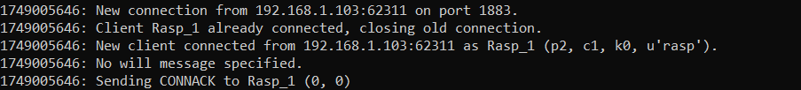
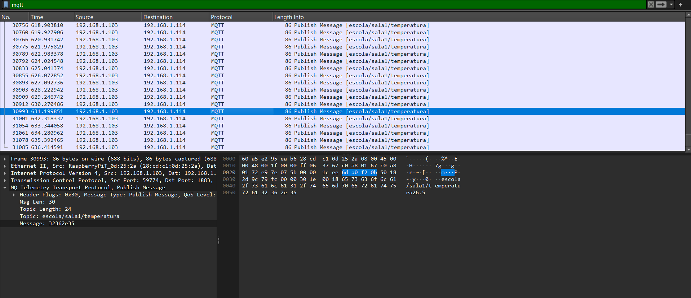
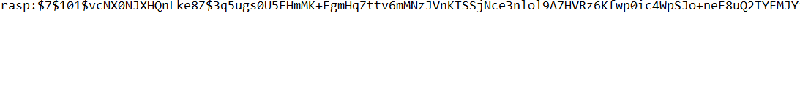
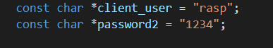
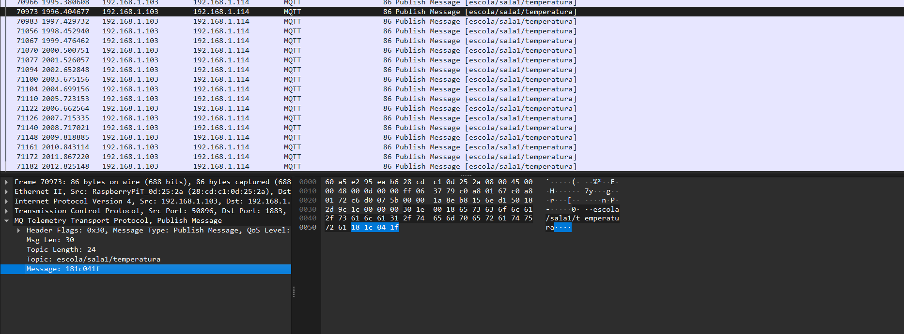
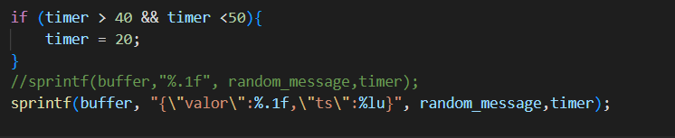

[](https://classroom.github.com/a/G8V_0Zaq)

# Tarefa: IoT Security Lab - EmbarcaTech 2025

Autor: **Insira Seu Nome**

Curso: Residência Tecnológica em Sistemas Embarcados

Instituição: EmbarcaTech - HBr

Campinas, ___ de 2025

---
# BitDogLab MQTT IoT Project

Projeto de comunicação IoT utilizando BitDogLab (Raspberry Pi Pico W) com protocolo MQTT, implementando conectividade Wi-Fi, autenticação e criptografia básica.

## 📋 Índice

- [Visão Geral](#visão-geral)
- [Requisitos](#requisitos)
- [Estrutura do Projeto](#estrutura-do-projeto)
- [Implementação](#implementação)
  - [Etapa 1: Conectividade Wi-Fi](#etapa-1-conectividade-wi-fi)
  - [Etapa 2: Setup MQTT Básico](#etapa-2-setup-mqtt-básico)
  - [Etapa 3: Publicação MQTT sem Segurança](#etapa-3-publicação-mqtt-sem-segurança)
  - [Etapa 4: Autenticação no Mosquitto](#etapa-4-autenticação-no-mosquitto)
  - [Etapa 5: Criptografia Leve (XOR)](#etapa-5-criptografia-leve-xor)
  - [Etapa 6: Proteção contra Replay Attack](#etapa-6-proteção-contra-replay-attack)
- [Como Usar](#como-usar)
- [Troubleshooting](#troubleshooting)

## 🎯 Visão Geral

Este projeto demonstra a implementação de um sistema IoT completo usando BitDogLab (Raspberry Pi Pico W), abrangendo desde conectividade básica Wi-Fi até implementação de segurança com criptografia e proteção contra ataques de replay.

## 🛠️ Requisitos

### Hardware
- BitDogLab (Raspberry Pi Pico W)
- Display integrado

### Software
- Raspberry Pi Pico SDK
- Mosquitto MQTT Broker
- Wireshark (para análise de tráfego)

### Bibliotecas
- `pico_cyw43_arch_lwip_threadsafe_background`
- `pico_lwip_mqtt`
- `pico_cyw43_driver`

## 📁 Estrutura do Projeto

```
├── connections/
│   ├── wifi_control.c      # Controle de conectividade Wi-Fi
│   └── mqtt_comm.c         # Comunicação MQTT
├── criptografias/          # Funções de criptografia
├── main.c                  # Arquivo principal
└── lwipopts.h             # Configurações LWIP
```

## 🚀 Implementação

### Etapa 1: Conectividade Wi-Fi

**Arquivo:** `connections/wifi_control.c`

**Biblioteca:** `pico_cyw43_arch_lwip_threadsafe_background`

**Include principal:** `#include "pico/cyw43_arch.h"`

#### Funcionamento
A função de conexão Wi-Fi é executada no loop principal, recebendo:
- **SSID:** Nome da rede Wi-Fi
- **Senha:** Senha da rede

A implementação gerencia a inicialização do módulo Wi-Fi da Pico W e realiza conexão assíncrona e thread-safe.


---

### Etapa 2: Setup MQTT Básico

**Arquivo:** `connections/mqtt_comm.c`

**Bibliotecas:** 
- `pico_lwip_mqtt`
- `pico_cyw43_driver`

**Includes principais:**
```c
#include "lwip/apps/mqtt.h"      
#include "lwipopts.h"             
```

#### Configuração
O arquivo `lwipopts.h` foi adaptado dos exemplos da extensão Raspberry Pi Pico e modificado conforme documentação oficial.

---

### Etapa 3: Publicação MQTT sem Segurança

#### Funcionalidades
- Envio de mensagens para o broker MQTT
- Exibição de mensagens nos displays do publisher e subscriber

#### Configuração do Mosquitto
**Arquivo de configuração (.conf):**
- Porta: `1883`
- Configuração: `allow_anonymous true` (descomentada)

**Iniciando o broker:**
```bash
# Execute como administrador
mosquitto -v
```
<p align = "center">
    
</p>

<p align = "center">
    
</p>

---

### Etapa 4: Autenticação no Mosquitto

#### Criação de Credenciais
```bash
# Criar arquivo de senhas
mosquitto_passwd -c nome_do_arquivo senha_do_arquivo
```

Este comando gera um arquivo contendo o ID do usuário e o hash da senha correspondente.

#### Segurança
- Remoção de acesso anônimo
- Implementação de autenticação baseada em credenciais
- Validação de usuários através de arquivo de senhas

<p align = "center">
    
</p>

<p align = "center">
    
</p>

---

### Etapa 5: Criptografia Leve (XOR)

**Arquivo:** `criptografias/`

#### Implementação
- Função de subscribe em `mqtt_comm.c`
- Implementação de criptografia XOR simétrica
- Mesma função para encriptação e decriptação

#### Funcionamento
1. Mensagem é criptografada antes do envio
2. Subscriber recebe e descriptografa a mensagem
3. Resultado exibido no display
4. Tráfego criptografado pode ser analisado via Wireshark

<p align = "center">
    
</p>

---

### Etapa 6: Proteção contra Replay Attack

#### Implementação de Timestamp
- Utilização da função `timer_us_32()` para timestamp
- Medição em milissegundos desde inicialização do processador
- Inclusão do timestamp na mensagem criptografada

#### Detecção de Replay
- Processamento de timestamp na função subscribe
- Validação temporal das mensagens
- Exibição de "Replay detectado" em caso de ataque identificado

#### Segurança Aprimorada
- Proteção contra retransmissão maliciosa
- Validação temporal de mensagens
- Detecção automática de tentativas de replay

<p align = "center">
    
</p>

---

## 🔧 Como Usar

### 1. Configuração inicial
```c
// Configure as credenciais Wi-Fi
#define WIFI_SSID "sua_rede"
#define WIFI_PASSWORD "sua_senha"

// Configure o broker MQTT
#define MQTT_BROKER_IP "192.168.x.x"
#define MQTT_PORT 1883
```


### 3. Execução
1. Faça upload do firmware para a BitDogLab
2. Inicie o broker Mosquitto
3. Monitor via display integrado

## 🔍 Troubleshooting

### Problemas Comuns

**Falha na conexão Wi-Fi:**
- Verifique SSID e senha
- Confirme se a rede está ativa
- Verifique compatibilidade da rede (2.4GHz)

**Erro de conexão MQTT:**
- Confirme se o broker está rodando
- Verifique IP e porta do broker
- Teste credenciais de autenticação

---

## 📜 Licença
GNU GPL-3.0.
